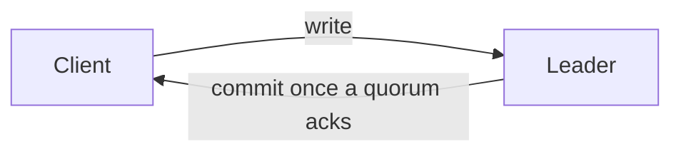

# Markdown Hover Glossary (browser)

A local browser viewer for Markdown documents with a **per-document glossary**.
Hover a term to see a rich definition and example in a little card — so the prose
stays lean and the detail is available on demand.

Each document carries its own glossary, embedded at the bottom of the file inside
an HTML comment. The file renders clean everywhere (GitHub, editors); the hovers
appear only in this viewer.

## Quick start

Run one persistent server, then paste file paths into the box at the top of the
page — like a little local dashboard.

```bash
npm install
npm run build
npm run serve          # opens http://localhost:4321
```

At the top of the page, paste a path to a Markdown file (absolute or `~/…`) and
press **Open**. The doc renders with its glossary terms hoverable. The path is
kept in the URL (`?path=…`) so reloads and bookmarks work, recent files
autocomplete in the box, and the view live-reloads when the file changes.

Options: `npm run serve -- --port 5000`, `npm run serve -- --no-open`. You can also
preload a file: `npm run serve -- ~/swarun/notes/plan.md`.

Export a standalone, shareable HTML file (works over `file://`, no server):

```bash
npm run export -- samples/sample.md sample.html
```

## The glossary format

Put this at (or near) the end of the document. Because it's an HTML comment, it's
invisible in every other Markdown renderer.

````markdown
<!-- glossary
terms:
  - term: oracle strength
    aliases: [oracle, weak oracle]
    definition: |
      Given that a test reached the code, would it notice if the code were wrong?
    example: |
      Weak — reached but unchecked:

      ```csharp
      result.Should().NotBeNull();
      ```

      Strong — checks the outcome:

      ```csharp
      result.Status.Should().Be(Eligible);
      ```
  - term: patch coverage
    definition: |
      The fraction of newly changed lines exercised by tests in a PR.
-->
````

### Fields

| Field        | Required | Notes                                                        |
| ------------ | -------- | ------------------------------------------------------------ |
| `term`       | yes      | The canonical phrase. Multi-word phrases are supported.      |
| `definition` | yes      | Markdown. Rendered in the hover card.                        |
| `aliases`    | no       | Other surfaces that trigger the same card (plurals, etc.).   |
| `example`    | no       | Markdown, shown in a separate "Example" section. Code works. |
| `link`       | no       | A URL shown as a "More →" link in the card.                  |

Matching is whole-word and case-insensitive by default. Longer phrases win over
shorter ones they contain. Terms inside code spans, code blocks, and links are
never marked.

### When there's no glossary block

Plenty of documents were written before this viewer existed and carry their
definitions some other way. Rather than showing them with zero terms, the viewer
falls back to two common conventions:

1. **Inline `<abbr>` tags** — `<abbr title="Definition here">TERM</abbr>`. The
   title becomes the definition. The `title` is then stripped from the rendered
   HTML so you get the hover card instead of the browser's native tooltip.
2. **A Markdown table under a "Glossary" heading** — first column is the term,
   second is the definition. Both are read; table entries win on conflict, since
   they're usually the fuller write-up.

Term cells are parsed forgivingly: `**PGW / Public Gateway**` yields an alias,
as does `**Elasticsearch (ES)**`. Only a slash *with spaces around it* separates
surfaces, so `go/911, go/912` survives. A parenthetical naming another defined
term is treated as a disambiguator and dropped, so `**tier** (DAG)` doesn't
hijack `DAG`.

These fallbacks are lossy — no examples, no links — and apply only when no
`glossary` block is present. The status bar says which source was used. To take
full control of a document, add a real block.

## Diagrams

A ```` ```mermaid ```` fence is drawn as a diagram — flowcharts, sequence
diagrams, state charts, ER diagrams, and anything else Mermaid supports.

````markdown

````

Hovering a diagram reveals an **Expand** button that opens it full screen, where
the scroll wheel zooms and dragging pans. `Esc`, the **Close** button, or a click
on the backdrop dismisses it.

Notes:

- Mermaid is ~3.5MB, so it is fetched only when a document actually has a
  diagram. `npm run build` vendors it to `web/vendor/`, and the server serves it
  locally — no CDN on the normal path. Exported HTML falls back to a CDN, since
  there is no server to serve it from.
- Diagram text is never treated as prose, so glossary terms inside a diagram are
  left alone. They still hover normally in the surrounding text.
- If a diagram fails to parse, the viewer shows Mermaid's error above the
  original source rather than swallowing it.
- Diagrams follow the light/dark colour scheme and redraw when it changes.

## How it works

- `src/glossary.ts` + `src/term-index.ts` — parse the embedded glossary and build
  the term matcher.
- `src/derive-terms.ts` — fallback harvesting of `<abbr>` tags and Glossary tables
  for documents with no block.
- `src/render.ts` — render Markdown to HTML (glossary stripped) and pre-render each
  definition/example blurb to HTML. Also turns ```` ```mermaid ```` fences into
  placeholders. Bundled to `dist/core.node.mjs`.
- `src/browser/glossary-ui.ts` — underline terms in the rendered DOM and show
  hover cards.
- `src/browser/mermaid-ui.ts` — lazy-load Mermaid, draw the placeholders, and run
  the full-screen zoom/pan viewer. Bundled with the above to `web/dist/app.js`.
- `scripts/serve.mjs` — dev server: renders on request, serves the viewer, pushes
  live-reload events over SSE. It re-imports the renderer whenever
  `dist/core.node.mjs` changes, so `npm run watch` and `npm run serve` can run
  side by side without restarts.
- `scripts/build-html.mjs` — inlines CSS + JS + data into one standalone HTML file.

## Develop

```bash
npm run typecheck
npm run verify      # Node parser/render checks + a headless (jsdom) run of the real bundle
```

## For agents authoring docs

When creating a new Markdown artifact, append a `glossary` block defining the
non-obvious terms you introduce. Keep definitions to a couple of sentences and add
an `example` for anything worth seeing used. Don't retrofit glossaries onto
existing documents unless asked.
