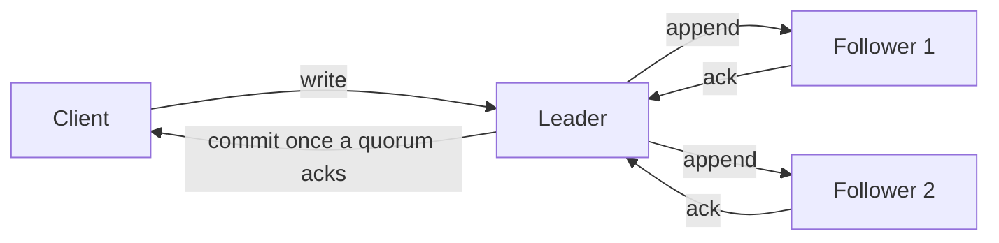
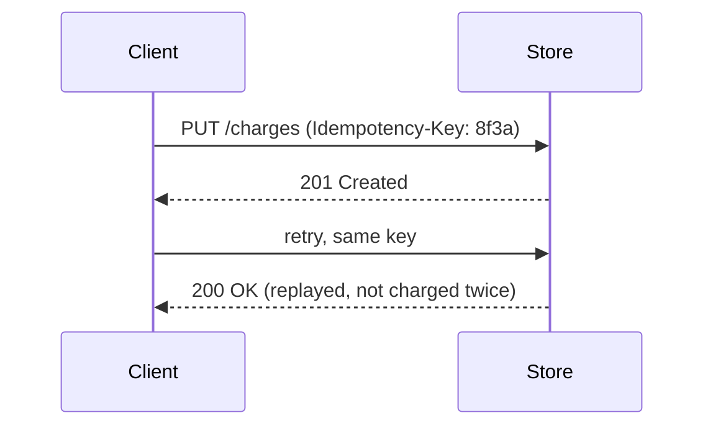

# The Distributed Systems Field Guide

A short tour of the words people throw around when a system stops fitting on one
machine. Every dotted-underlined term has a definition one hover away — so this
page stays readable instead of ballooning into a textbook.

> Try it: **hover** a term for its card, **click** a term to pin the card open,
> press **Esc** to dismiss it, or **Tab** through the page to focus terms with the
> keyboard.

---

## 1. Agreeing on the truth

When several machines each hold a copy of the data, the hard part isn't storing
it — it's agreeing on it. Most systems reach agreement through a consensus
protocol, and most of those only commit a change once a quorum of nodes has
acknowledged it. Before a node applies anything it usually appends the change to
a write-ahead log, so a crash mid-update can be replayed rather than lost.

Not every system pays for that up front. Many choose eventual consistency
instead: writes propagate lazily, replicas disagree for a while, and background
mechanisms like read repair quietly reconcile them. Deletes are their own
puzzle — you can't just remove a row, because a stale replica would resurrect it,
so systems write a tombstone marker instead.

Notice that consensus and quorums show up again and again; good definitions mean
you can keep reading without breaking your stride to look them up.

## 2. When the network splits

Sooner or later the network partitions, and the CAP theorem says you get to keep
serving requests or keep every replica in agreement — not both.

| Choice | Under a partition | Example systems |
| ------ | ----------------- | --------------- |
| CP     | Refuse writes to preserve one truth | etcd, ZooKeeper, Spanner |
| AP     | Keep serving, reconcile later via eventual consistency | Dynamo, Cassandra |

The right answer depends on the data. A bank ledger wants CP; a shopping-cart
service can usually tolerate being eventually consistent.

## 3. Staying up under load

Three ideas do most of the heavy lifting for resilience:

- **Backpressure** — when a consumer can't keep up, it pushes the slowdown
  upstream instead of silently dropping work or falling over.
- **Circuit breakers** — after enough failures, stop calling a sick dependency for
  a while so it can recover, and fail fast in the meantime.
- **Idempotent operations** — retries are inevitable, so design writes that can be
  applied twice with no extra effect.

Idempotency is the quiet hero here: with it, backpressure and circuit breaker
retries are safe; without it, every retry risks double-charging someone.

## 4. Where the data lives

Spreading data across nodes without reshuffling everything on each membership
change is the job of consistent hashing. Tracking *who saw what, when* — so two
concurrent edits can be detected rather than blindly overwritten — is the job of
a vector clock.

## 5. Diagrams

A ```` ```mermaid ```` fence is drawn as a diagram. Hover **Expand** in the corner
to open it full screen, where the scroll wheel zooms and dragging pans.



Diagram text is never treated as prose, so the word "quorum" above stays plain
inside the diagram while still being hoverable in this sentence.



## 6. What does *not* get underlined

Glossary terms are matched in prose only. Inside code they're left alone, on
purpose. This inline mention of `quorum` and this block are untouched:

```python
def has_quorum(acks, nodes):
    # "quorum" and "tombstone" here are code, not glossary terms
    return acks > nodes // 2
```

Links aren't rewritten either, and matching is case-insensitive, so Quorum,
QUORUM, and quorum all resolve to the same card.

<!-- glossary
terms:
  - term: consensus
    aliases: [consensus protocol, consensus algorithm]
    definition: |
      A protocol that lets a group of nodes agree on a single value or an ordered
      log of changes, even when some nodes are slow or crashed.
    example: |
      **Raft** and **Paxos** are the classics. Raft elects a leader that appends
      entries to a replicated log and commits them once a majority acknowledges.
    link: https://raft.github.io/

  - term: quorum
    aliases: [quorums]
    definition: |
      The minimum number of nodes that must respond for an operation to count.
      A majority quorum is `floor(N/2) + 1`, which guarantees any two quorums
      overlap on at least one node.
    example: |
      With `N = 5`, a quorum is 3. Requiring a read quorum **R** and write quorum
      **W** with `R + W > N` guarantees a read sees the latest write:

      ```text
      N = 5, W = 3, R = 3   ->   R + W = 6 > 5  ✓
      ```
    link: https://en.wikipedia.org/wiki/Quorum_(distributed_computing)

  - term: write-ahead log
    aliases: [WAL, write-ahead logging]
    definition: |
      Append every change to a durable, sequential log *before* modifying the
      main data structures. On crash, replay the log to recover.
    example: |
      Postgres, SQLite, and most LSM-tree stores do this. The rule: the log entry
      must hit disk before the change is considered committed.

  - term: eventual consistency
    aliases: [eventually consistent]
    definition: |
      A guarantee that if no new writes happen, all replicas *eventually* converge
      to the same value — but at any given moment they may disagree.
    example: |
      You update your profile photo and a friend still sees the old one for a few
      seconds. Acceptable here; not acceptable for an account balance.

  - term: read repair
    definition: |
      When a read notices that replicas returned different values, it writes the
      newest value back to the stale replicas as a side effect.
    example: |
      A quorum read gets `v7` from two nodes and `v5` from a third; the client (or
      coordinator) pushes `v7` to the lagging node before returning.

  - term: tombstone
    aliases: [tombstones]
    definition: |
      A marker that records a deletion, instead of removing the row outright, so
      the delete can propagate to replicas that were offline. Purged later during
      compaction.
    example: |
      Without a tombstone, a node that missed the delete would replicate the row
      back and the "deleted" data would rise from the grave.

  - term: CAP theorem
    aliases: [CAP]
    definition: |
      During a network **P**artition you can have **C**onsistency or
      **A**vailability, not both. With no partition you can have both — CAP is
      about the tradeoff *when the network breaks*.
    example: |
      A CP store rejects writes on the minority side of a split; an AP store keeps
      accepting them and reconciles once the partition heals.
    link: https://en.wikipedia.org/wiki/CAP_theorem

  - term: backpressure
    definition: |
      A flow-control signal that pushes "slow down" back to producers when a
      consumer is overwhelmed, instead of dropping work or crashing.
    example: |
      A bounded queue that blocks (or rejects) on `put()` when full is
      backpressure. TCP's receive window is the canonical example.

  - term: circuit breaker
    aliases: [circuit breakers]
    definition: |
      A wrapper around a remote call that trips **open** after repeated failures,
      fails fast for a cooldown, then allows a trial call (**half-open**) before
      **closing** again.
    example: |
      ```text
      closed     →  open        (after too many failures)
      open       →  half-open   (after a cooldown)
      half-open  →  closed      (a trial call succeeds)
      ```

  - term: idempotency
    aliases: [idempotent, idempotent operation, idempotent operations]
    definition: |
      A property where applying an operation many times has the same effect as
      applying it once — the key to safe retries.
    example: |
      Attach a client-generated key so replays are deduplicated:

      ```http
      PUT /charges/8f3a-... 
      Idempotency-Key: 8f3a-...
      ```

      The server records the key; a second request with the same key returns the
      first result instead of charging again.

  - term: consistent hashing
    definition: |
      Map both keys and nodes onto a ring; a key belongs to the next node
      clockwise. Adding or removing a node only moves the keys near it, not the
      whole dataset.
    example: |
      Move from 4 to 5 nodes and only ~1/5 of keys relocate, versus nearly all of
      them with a plain `hash(key) % N` scheme.
    link: https://en.wikipedia.org/wiki/Consistent_hashing

  - term: vector clock
    aliases: [vector clocks]
    definition: |
      A per-node counter vector that captures causality: given two versions, you
      can tell whether one happened-before the other or they are concurrent (a
      genuine conflict).
    example: |
      `A:2, B:1` vs `A:2, B:2` — the second descends from the first, so no
      conflict. `A:2, B:1` vs `A:1, B:2` are concurrent and must be merged.
-->
